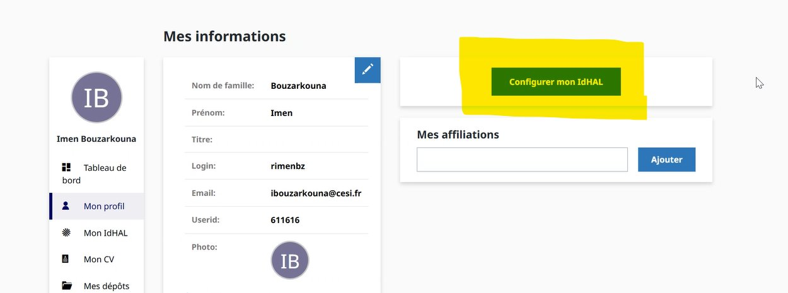
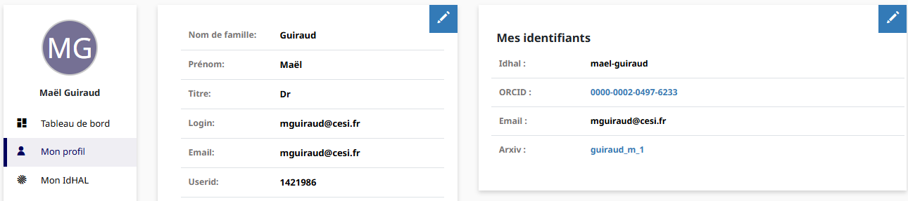
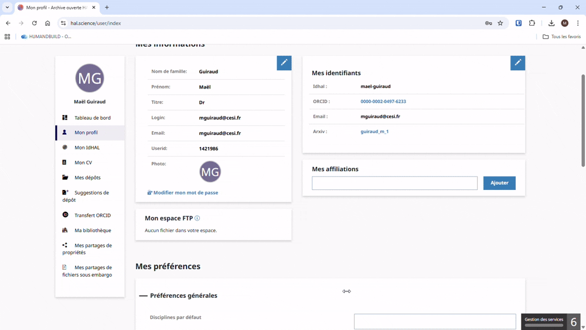
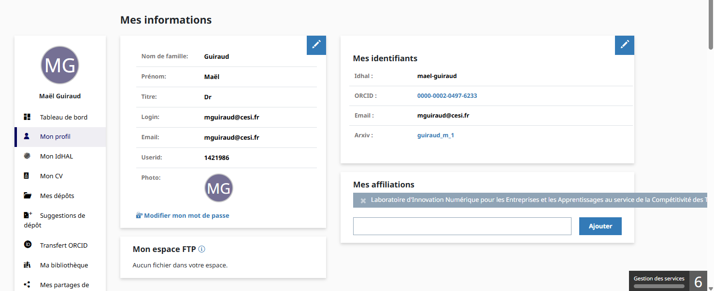

# Configuration de votre compte HAL

## Création du compte

Rendez-vous sur [https://hal.science/](https://hal.science/) et renseignez vos informations personnelles de connexion.

---

## Configurer votre IdHAL

Une fois connecté, il est **impératif** de configurer votre IdHAL :

Une fois votre IdHAL correctement créé, vous devriez avoir ceci :

> Vous pouvez lier votre compte ORCID, Scholar, ou autre si vous le souhaitez.

---

## Ajouter l'affiliation LINEACT

Il faut ensuite ajouter **LINEACT** à vos affiliations :

> ⚠️ Veillez à bien prendre l'option **verte**.
> Si vous avez d'autres affiliations, vous pouvez les rajouter.

---

## Résultat final attendu

À la fin, vous devez avoir :

- ✅ Un **IdHAL**
- ✅ L'affiliation **LINEACT**

