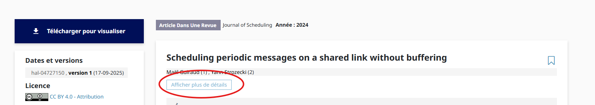
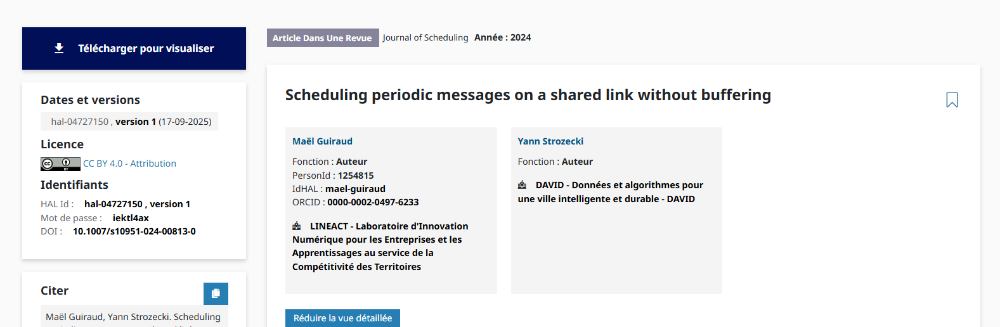
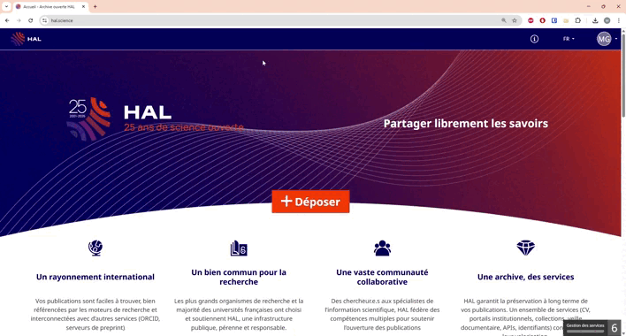
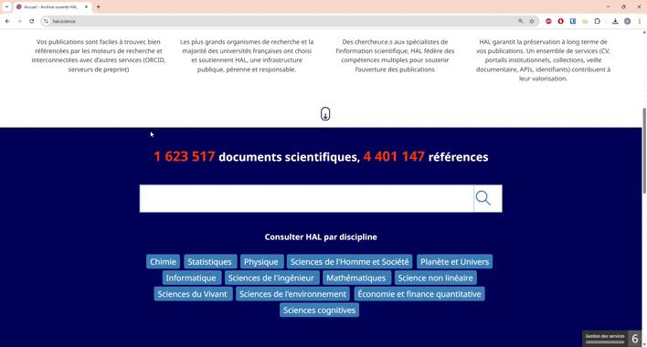

# Consulter vos articles sur HAL

Sur HAL, vos articles peuvent être ajoutés par vous-même, ou par un tiers.

> Certains articles ont peut-être été déposés soit par vous ou d'autres avant l'initialisation de votre IdHAL, soit par d'autres mais n'ayant pas vérifié que les auteurs soient correctement remplis.

---

## Articles correctement liés à votre IdHAL

Pour consulter la liste des articles qui sont correctement liés à votre IdHAL, vous avez deux options :

### Option 1 — Tableau de bord

Accédez à l'onglet **« Mes dépôts »** de votre tableau de bord :


### Option 2 — Requête directe

Utilisez le lien suivant en remplaçant `VOTRE_ID_HAL` par votre IdHAL :

```
https://hal.science/search/index/q/*/authIdHal_s/VOTRE_ID_HAL
```

**Exemple** pour l'IdHAL `david-baudry` :

```
https://hal.science/search/index/q/*/authIdHal_s/david-baudry
```

---
## Consulter l'intégralité des articles avec votre nom comme auteur

Il est possible que certains articles soient déposés avec votre nom, mais ne soient pas correctement liés à votre IdHAL.

Pour le savoir, lorsque vous êtes sur un article, cliquez sur **« Afficher plus de détails »** :



Vous avez alors le détail des auteurs. Dans cet exemple, le papier est correctement lié à l'auteur **« Maël Guiraud »** (IdHAL apparent), mais pas à l'auteur **« Yann Strozecki »**.



### Rechercher par votre nom

Pour chercher l'intégralité des articles avec votre nom, utilisez la barre de recherche, exemples ci-dessous.

> ⚠️ **ATTENTION** : Veillez à saisir votre nom **entre guillemets**. Sans cela, HAL affichera tous les articles dont les auteurs partagent votre prénom ou votre nom. Par exemple, pour `David Baudry`, HAL pourrait vous proposer un article de *David Delaunay* ou de *Muriel Rabiller-Baudry*.

**Exemple sans guillemets :**



**Exemple avec guillemets :**



Dans ce cas, pour « David Baudry » sans guillemets et « David Baudry » avec guillemets, la différence est cruciale : pensez donc à bien les utiliser pour éviter de polluer vos résultats.

---

## Comparer les deux listes

Il vous revient de comparer les résultats obtenus par recherche via l'IdHAL et ceux obtenus par recherche via le nom, afin de vous assurer que tous les articles dans lesquels vous êtes co-auteur contiennent bien votre IdHAL. Pour ce faire, référez-vous au guide [Modifier un article](./04_modifier_un_article.md).
