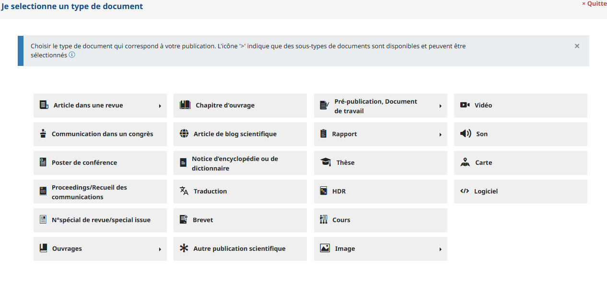
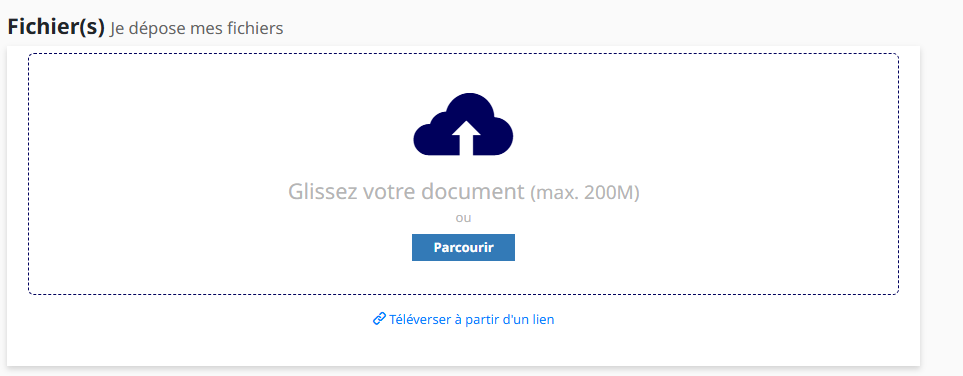
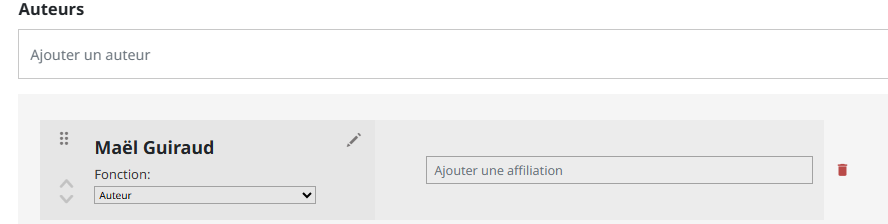
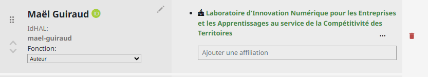
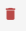
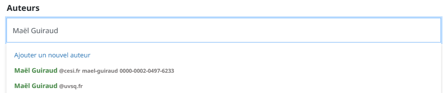

# Ajouter un article sur HAL

## Étape 1 — Cliquer sur « Déposer »

Lorsque vous ajoutez un article sur HAL, l’ensemble de vos co-auteurs y sont lié.
Avant de déposer un article, vérifiez que votre article n’a pas déjà été déposé par quelqu’un d’autre (cf : [Consulter ses articles](./02_consulter_mes_articles.md)).
Si l’article existe déjà et que vous voulez le modifier, consultez le guide «[Modifier un article](./04_modifier_un_article.md)  », sinon, suivez la procédure suivante :
Cliquez sur le bouton « déposer » (au milieu de la page d’accueil, ou en haut à droite de votre tableau de bord) :

---

## Étape 2 — Choisir le type de document

Sélectionnez le type de document correspondant à votre publication :

---

## Étape 3 — Importer le fichier

Uploadez votre fichier PDF :

---

## Étape 4 — Vérifier les auteurs

### Un auteur mal renseigné

Si un auteur n'a pas son IdHAL lié, il apparaîtra comme ceci :

### Un auteur correctement renseigné

Un auteur correctement lié apparaît ainsi :

### Supprimer un auteur mal renseigné

### Ajouter un auteur correctement

Recherchez l'auteur et **sélectionnez la ligne avec l'IdHAL** :

---

## Étape 5 — Vérifier et soumettre

Vérifiez l'ensemble des métadonnées avant de valider :

> ✅ Cliquez sur **Déposer** pour finaliser.
