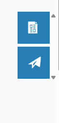
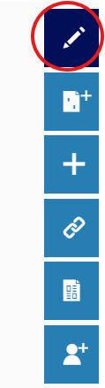
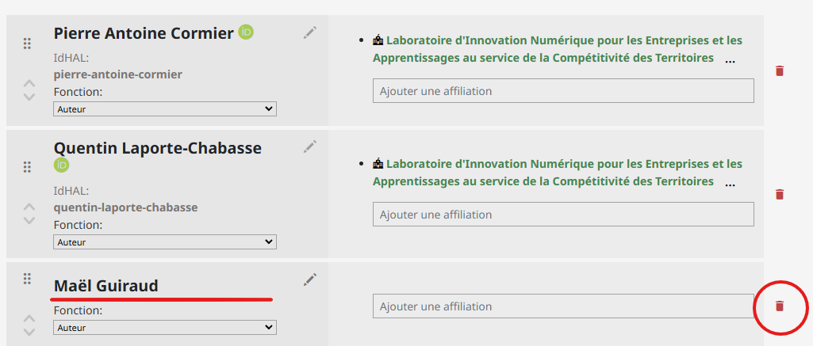
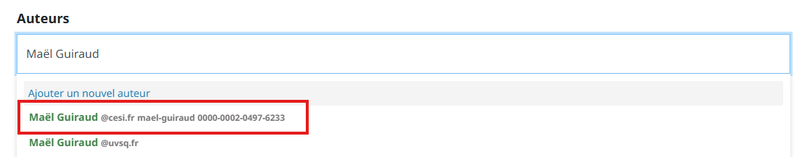
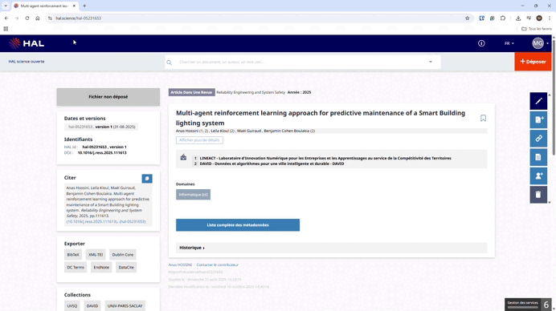

# Modifier un article sur HAL
Lorsque vous avez identifié un article dans lequel votre IdHAL où affiliation n’est pas correctement renseignée, vous devez le modifier. Pour cela, il faut d’abord vous assurez d’avoir soit la propriété de l’article, soit les droits d’édition.
Pour modifier un article, vous devez en être **le dépositaire** ou avoir obtenu **les droits d'édition**.

---

## Vérifier vos droits

Vous pouvez savoir immédiatement si vous pouvez modifier un article en regardant les icônes à droite :

| ❌ Sans droits de modification | ✅ Avec droits de modification |
|-------------------------------|-------------------------------|
|  |  |

---

## Vous n'avez pas les droits de modification

Il faut demander la propriété au dépositaire de l'article.

Cliquez sur l'icône correspondante :

Puis soumettez votre demande :

> ⏳ Vous devez ensuite **attendre** que le dépositaire vous autorise l'accès avant de continuer.

---

## Vous avez les droits de modification

Cliquez sur l'icône de modification :

### 1. Supprimer l'auteur mal renseigné

Cherchez l'auteur qui n'est pas correctement rempli et supprimez-le :

### 2. Rajouter l'auteur correctement

Rajoutez-le en faisant attention à **sélectionner la ligne qui contient l'IdHAL** :

### Exemple complet (supprimer puis rajouter)

---

> ✅ **Enregistrez ensuite les modifications.**
